# 选择智赛在线编排

合理的对阵编排是保证智力运动赛事公平、公正、激烈、有序的必要条件。

智赛在线编排是智赛网针对国内赛事编排需求，自主开发的在线编排算法，完全满足世界国际象棋联合会（FIDE）手册中关于瑞士制编排的各项要求。

通过编排测试比对，编排结果与目前的主流瑞士制编排软件swiss-Manager32，结果相似度超过99%。

智赛在线编排支持：
- 符合FIDE标准的瑞士制编排
- 自定义破同规则组合
- 多轮次同俱乐部回避
- 手工调整对阵及校验
- 团体赛编排
- 循环赛、淘汰赛编排
- 通过智赛网实时发布对阵、结果、排名

>以下介绍为瑞士制个人赛中使用智赛在线编排的介绍，对于团体赛请参考以下团体赛介绍。
- [个人循环赛](https://note.youdao.com/)
- [团体瑞士赛](https://note.youdao.com/)
- [团体循环赛](https://note.youdao.com/)

## 在线编排操作流程

在线编排工作分为以下几个步骤

1. 启用智赛编排
2. 导入名单
3. 赛前编排
4. 每轮结束登分
5. 下一轮编排
6. 相关功能

>在了解编排操作前，您需要了解以下功能，作为编排的准备工作
- [创建比赛](http://docs.zhisai.net/admin/#1)
- [比赛报名](http://docs.zhisai.net/admin/#6)
- [选手名单](http://docs.zhisai.net/admin/#8)

## 1.启用智赛编排

### 1-1.创建比赛中智赛在线编排

在创建比赛时，在编排软件项目中，选择智赛在线编排。

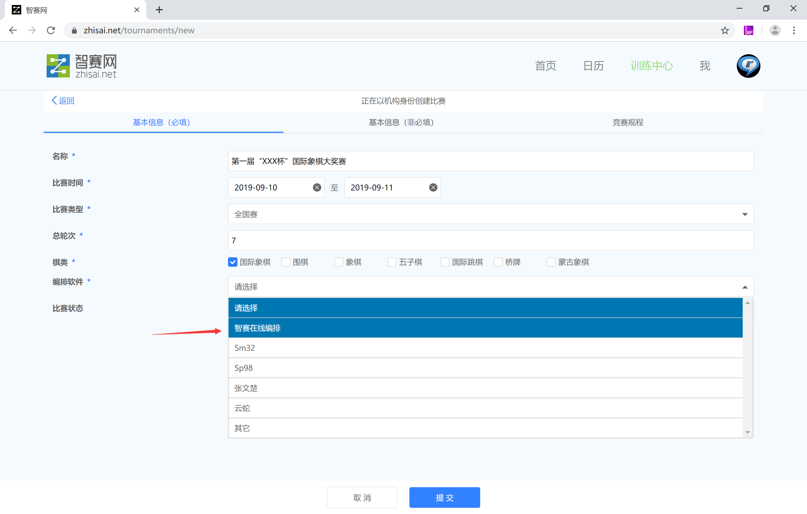

?>在比赛正式开始之前，您都可以修改比赛编排方式？

>关于创建比赛的其他项目，请查看 [创建比赛](http://docs.zhisai.net/admin/#1)

>关于其他编排的使用方式，请查看 [比赛编排](http://docs.zhisai.net/admin/#9-sm32)

### 1-2.设置破同分规则

破同分规则在竞赛规程中进行设置。

请按顺序勾选破同分，在下方破同分显示中，左侧优先级较高。

>涉及到对手分的规则，还有单独的设置，所有破同分规则定义及相关概念，请查看
[破同分规则详解](https://note.youdao.com/)

?>常见的破同分规则可以选择？？

### 1-3.在比赛组中启用具体设置

在比赛组的编排与数据对接标题下，可以对本组的编排要求进行详细设置

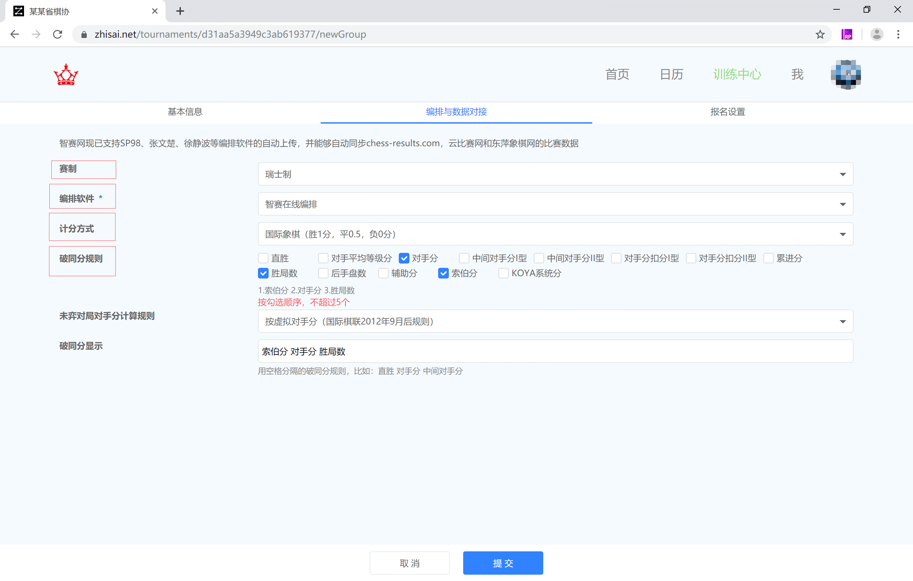

其中，赛制可以选择瑞士制、循环制、团体瑞士制、团体循环制

编排软件选择智赛在线编排

>关于其他编排的使用方式，请查看 [比赛编排](http://docs.zhisai.net/admin/#9-sm32)

根据您的需要设置计分规则和破同分规则

每个小组可以采用不同的编排设置

?>您可以在比赛期间，随时更改编排设置？

## 2.导入参赛选手名单

此时比赛各组已经完成报名，即将开始比赛。

在当前比赛组导入棋手名单

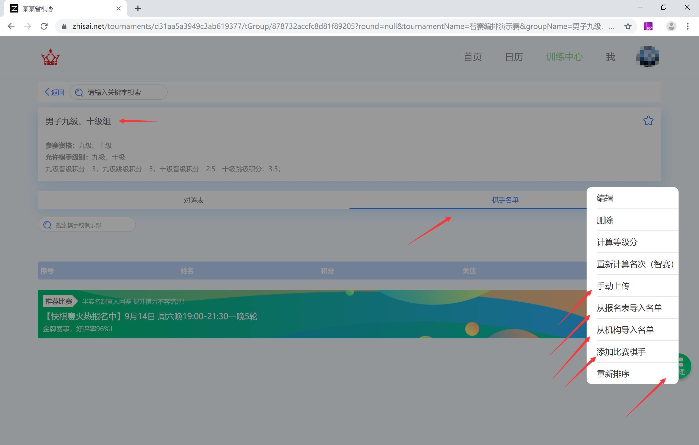

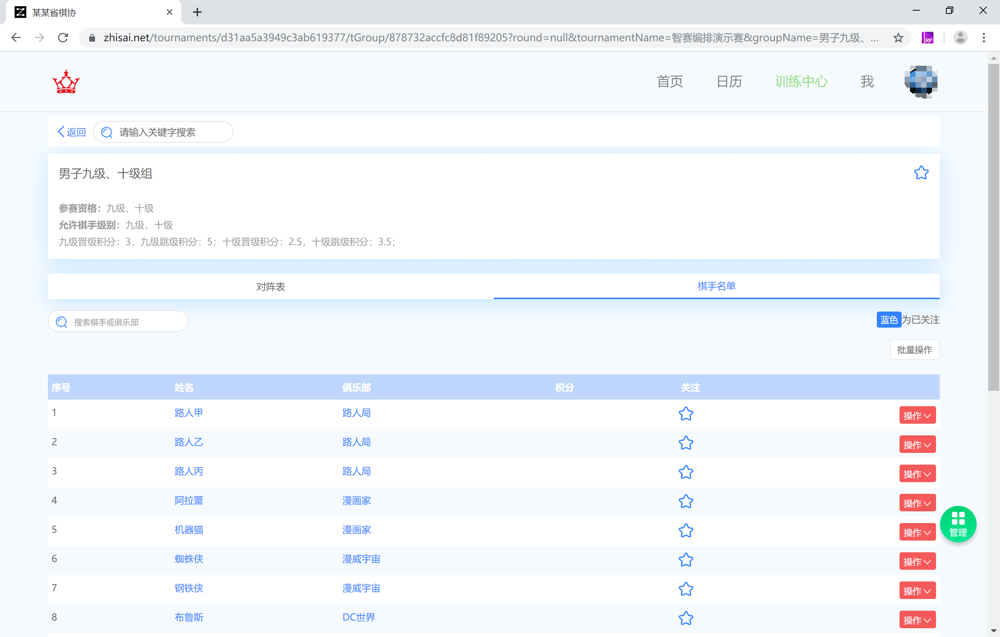

参赛选手名单可来自于从线上报名表导入名单、从机构导入名单、手动添加比赛棋手、手动上传等途径

>关于比赛报名和名单，请查看 [比赛报名](http://docs.zhisai.net/admin/#6)

## 3.赛前编排

在比赛正式开始前，可以对每个组的第一轮对阵进行提前编排。

赛前编排和每一轮的编排操作没有区别，只是有更充分的时间来操作编排，从而让比赛组织更方便。

### 3-1在比赛组中编排对阵表

现在可以开始编排了！

在比赛组中选择对阵表界面，并从编排中选择编排对阵表

设置第一位棋手颜色，目的是保证第一轮对阵满足随机要求

系统会经过计算，提供一个满足要求的对阵编排结果预览，在发布之前，编排老师还可以根据特殊要求进行手工修改

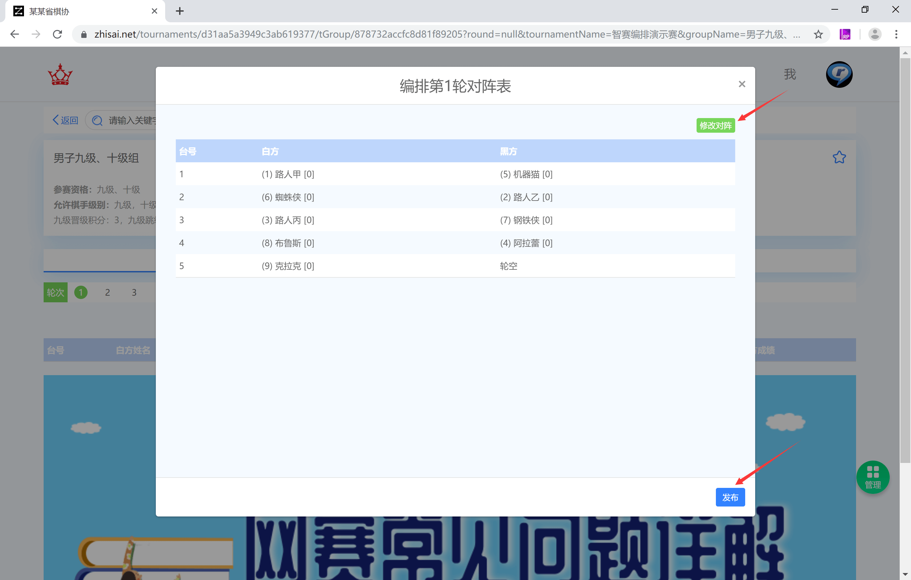

修改对阵表时，可通过下拉列表对对阵进行调整

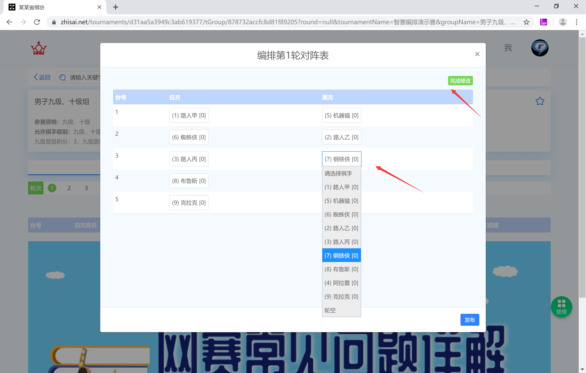

?>智赛在线编排提供了对手工修改的校验功能，保证经过手工修改对阵表必须满足编排原则?

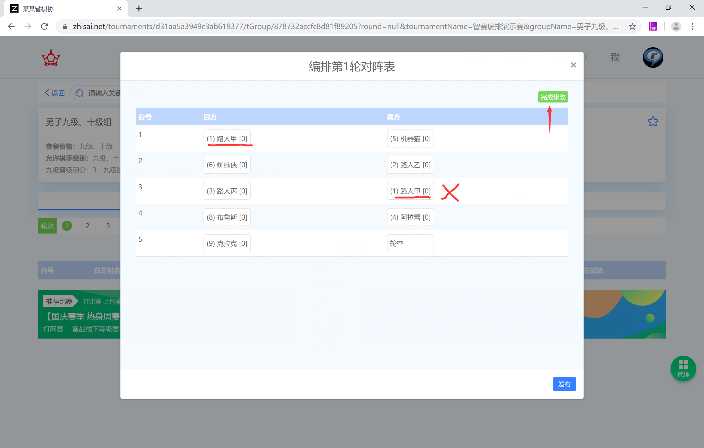

!> 注意！ 
尽管有校验功能，手工修改对阵表，可能引发的比赛参与者和关注者对公平公正性的质疑等严重问题，请勿轻易使用。 
如确实有修改必要，请务必听取权威编排老师意见。

发布对阵表后本轮对阵编排就算完成了

编排完成后，智赛网会通过微信发送通知给工作人员及比赛选手关注者

### 3-2 删除并重新编排

当因某些原因，导致需要重新编排本轮时，需要删除并重新编排本轮对阵。

首先需要删除当前对阵表

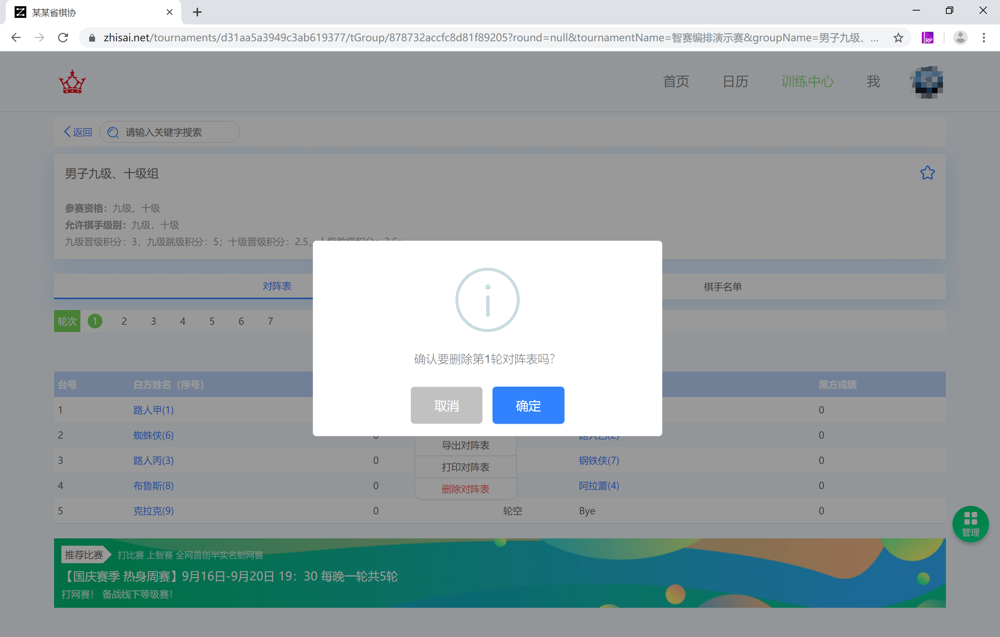

然后重新进行编排流程即可

## 4.每轮结束登分

如果您创建的是网赛，系统会自动完成登分工作，您可以在比赛结束后，直接开始下一轮的编排工作。

如果您创建的是比赛，需要根据棋手的上报的对战成绩，进行登分工作。

在对阵表界面的从编排中选择登分

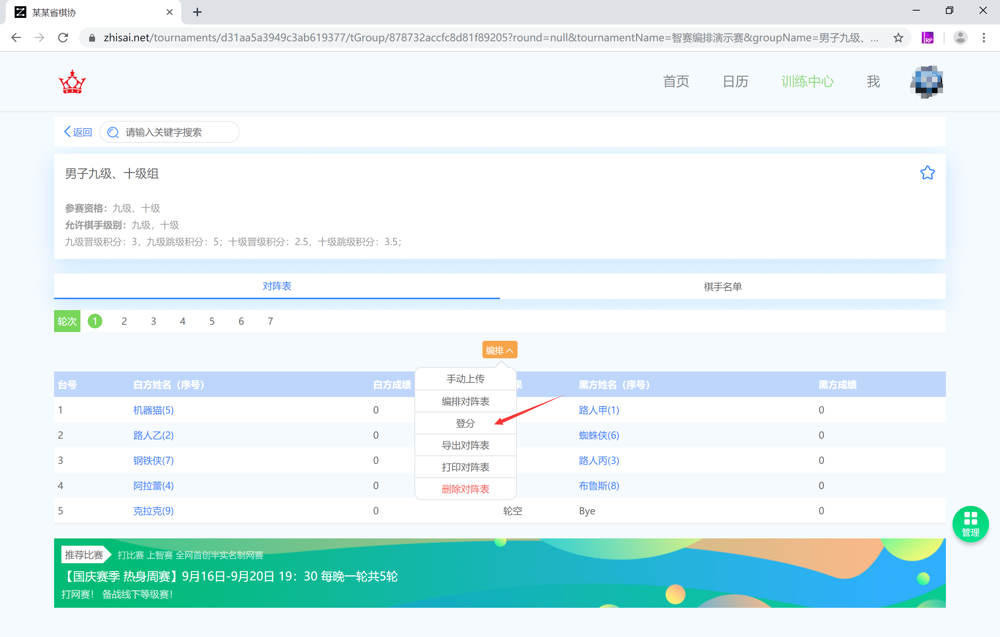

默认使用快捷键进行登分

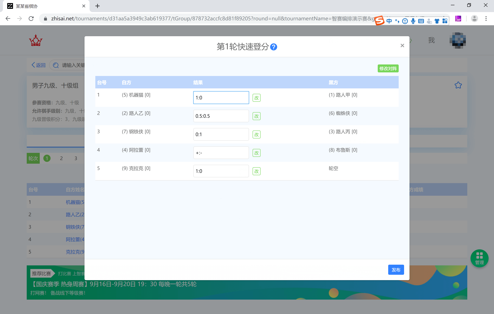

您可点击标题旁的问号查看，快捷键对应如下

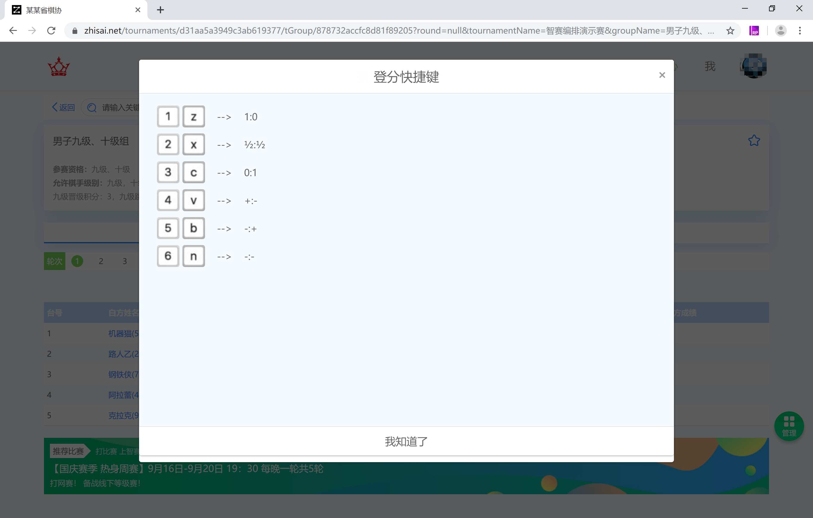

也可以使用手动修改的方式录入成绩

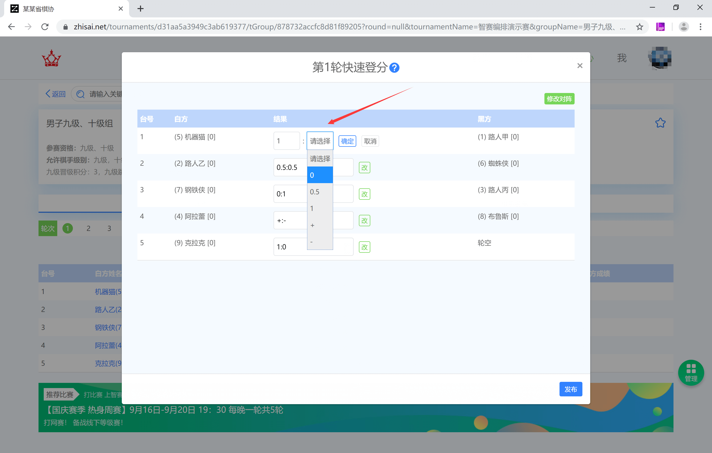

在登分界面可以修改对阵

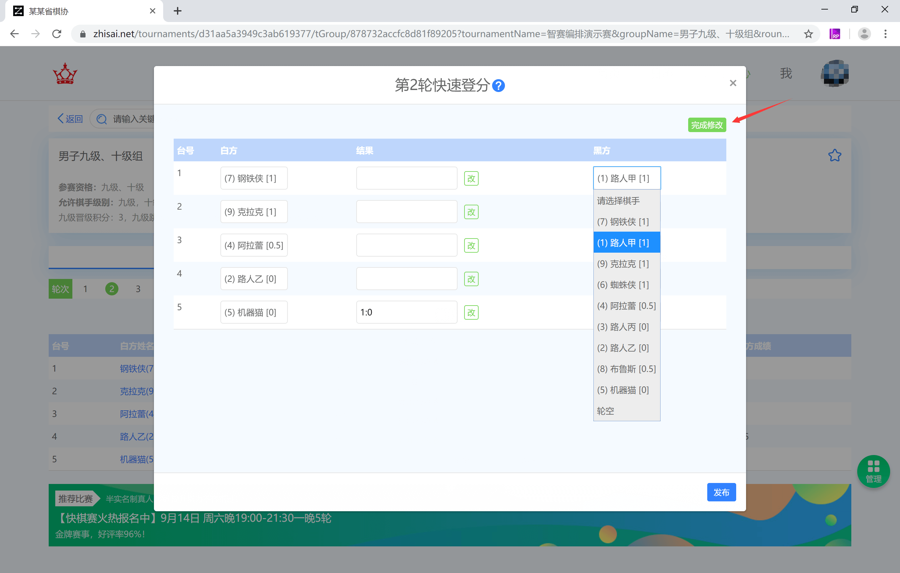

!> 注意！ 
尽管有校验功能，手工修改对阵表，可能引发的比赛参与者和关注者对公平公正性的质疑等严重问题，请勿轻易使用。 
如确实有修改必要，请务必听取权威编排老师意见。

## 5.下一轮编排

上一轮比赛所有登分结束前，不能进行下一轮比赛的编排

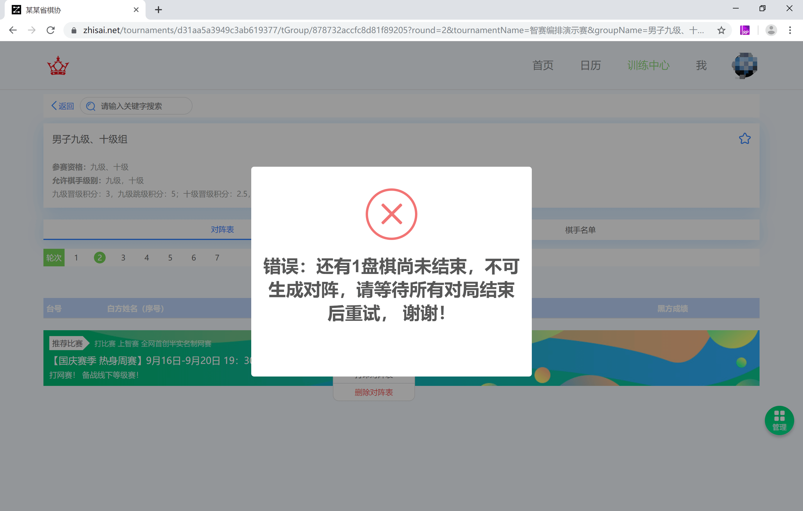

后续的编排和之前的操作没有区别

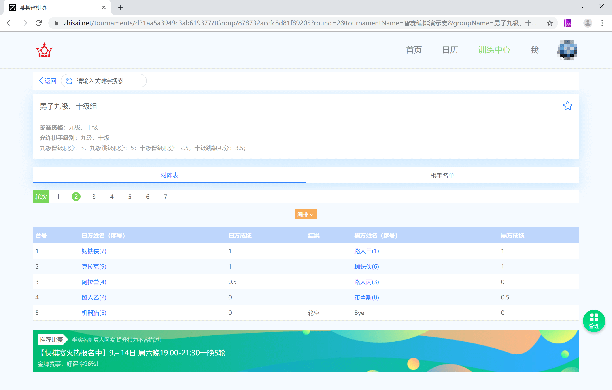

## 6.相关功能

### 6-1 打印对阵表

在编排中可以选择打印对阵表，打印纸质版对阵表

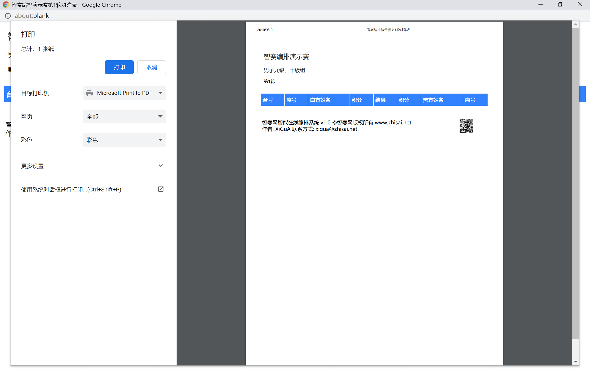

### 6-2 导出对阵表

在编排中可以选择导出对阵表，导出成EXCEL格式

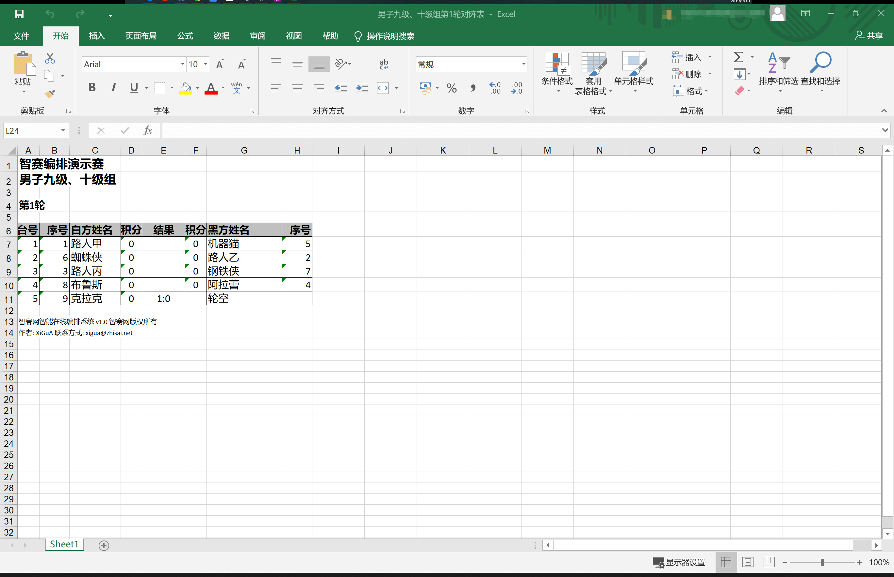

格式符合sp98、SM32等软件的基本格式，可以方便导入到其他编排软件

## 常见问题

## 团体赛的编排